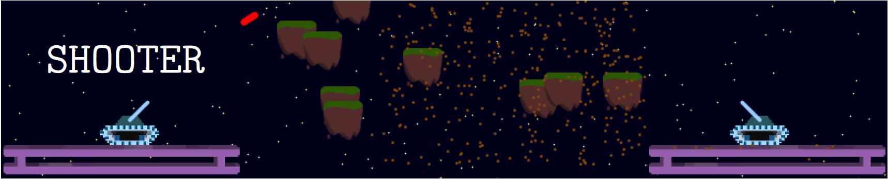

`Shooter` is turn-based artillery game set in 4018 AD.


<p align="center">
  <a href="#Usage">Usage</a> •
  <a href="#System Setup">System Setup</a> •
  <a href="#Tutorial">Tutorial</a> •
  <a href="#Download">Download</a> •
  <a href="#How to Contribute">How to Contribute</a> •
  <a href="#Acknowledgements">Acknowledgements</a>
</p>

**Usage**
---

```
Usage: java -jar Shooter.jar

  Starts the Game.
  Developed by Johannes Weck -> (Github: the-jojo)

```

**System Setup**
---

1. Install [`java`](https://www.java.com/en/download/)

2. Download the `Shooter` jar from Releases tab.


**Tutorial**
---

1. In the main game menu select either:

    + __Play 1 v 1__ - to play against a human opponent on the same computer 
        - Both players use the same controls.
    + __Play Story__ - to play in the story mode against an AI opponent


2. For both game modes, the gameplay is turn-based and runs for 5 games. The winner is the player who won the most games out of 5.
    + Controls:
        - a/d > move left/right
        - w/s > adjust gun angle
        - r/f > adjust gun power
        - space > fire gun

## Download

You can [download](https://github.com/the-jojo/Shooter/releases/tag/v1.2.0) the latest installable version of Markdownify for Windows, macOS and Linux.


**How to Contribute**
---

1. Clone repo and create a new branch: `$ git checkout https://github.com/the-jojo/Shooter -b name_for_new_branch`.
2. Make changes and test
3. Submit Pull Request with comprehensive description of changes

**Acknowledgements**
---

+ [@shobrook](https://www.github.com/shobrook) for logo and UI design assistance.
+ Base logo vector made by [Freepik](https://www.freepik.com/) from [Flaticon](www.flaticon.com).
+ [drduh's macOS-Security-and-Privacy-Guide](https://github.com/drduh/macOS-Security-and-Privacy-Guide) and [Jonathan Levin's MacOS Security Guide](http://newosxbook.com/files/moxii3/AppendixA.pdf) were incredibly helpful while I was building `stronghold`.

